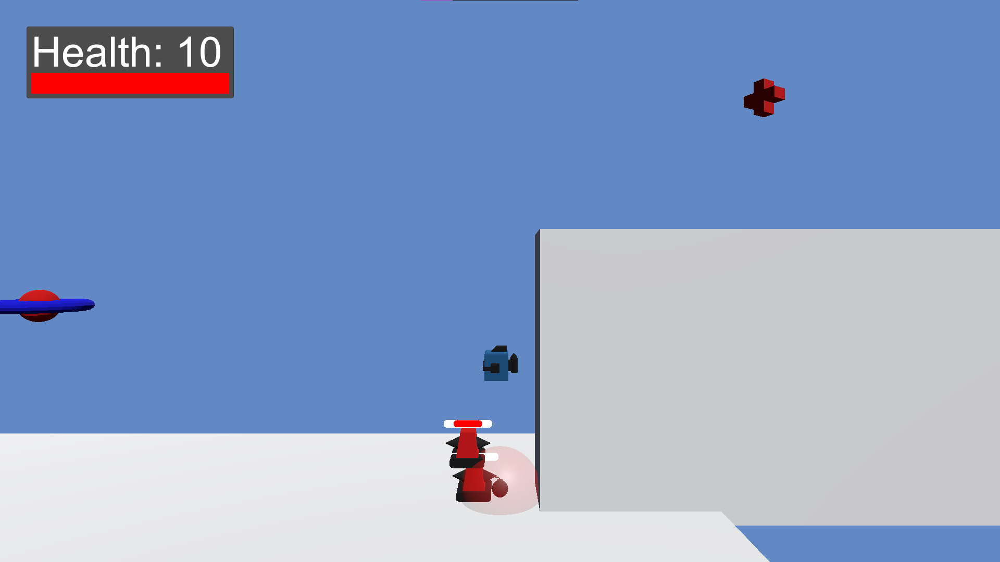

# Engines Aligned Component Replacement  
Entirety of JayPEG:  
Jonathan Jay (100743575)  
Matthew McPherson (100757379)  
Léo Buono (100748457)  
Log-Hei (Jonathan) Leung (100746578)  
Jaden Bhakti (100696653)

46 word description:  
This a 2.5D platformer with level editing capabilities, that has a player that can throw bombs and walljump, as well as enemies, all controlled by DLLs for UI and stats. The editor provides the base tools required to create levels with enemy spawners, healthpacks and crates.

Assignment 4 Video Link: https://youtu.be/8509LK0H0Bc  

To mod the game, grab the dll wanted from the DLLs folder and paste it into the plugins folder of Unity, then rename it ModDLL.dll or UIDLL.dll

We had a whopping 5/6(?) Design patterns implemented:  
Singleton in the event and command managers  
Observer using C# events  
Command using the FunctionData interface as base  
Factory using the Spawnable interface as base  
Object Pooling in the bomb system (Player.cs)  
----we would've used Object Pooling with factories if we implemented factory into spawners, but that didn't follow through because factories were hard to pass around
Dirty flag(?) in that pausing disables many systems (including physics, which is handled in EditorManager.cs)

Old description:

This game is a 2.5D platforming game. The player can move, jump, attack, and wall jump in order to fight enemies and reach the goal block at the end of the stage. In the level editor, the user gains control of anything that has a hitbox, aka everything. they can move them, scale them and even delete them (no deleting the player though). The editor tracks these changes and allows for undoing and redoing them. they can access this by just pausing the game (pressing P), this will pause physics, so do be wary of the players velocity when pausing.

Video Link: https://youtu.be/8509LK0H0Bc  
Mozilla Hub Room: https://hub.link/yapbHYN < for assignment 2  
In the hub, you can see models of our level on either side of the room. In the centre is a large screen displaying our youtube video. Please enjoy.

Screenshots and UML:

Normal View  

UI after some changes  

Game After those changes  

UML:  

Main Controls:  
WASD or Arrows to move  
Space to jump  
E or Right Shift to attack
R or / to throw a bomb

P to toggle between modes

Editor Controls:  
Left Click to select  
Drag on selected to move  
Drag scale sliders to scale object  
----Right Click to confirm scale  
Delete to delete selected object (if prompt appears)  
Rename objects by clicking in the name box in the top right  
Undo with Z, redo with R
Left Shift or \ to snap camera to player

To mod the game, grab the dll wanted from the DLLs folder and paste it into the plugins folder of Unity, then rename it ModDLL.dll or UIDLL.dll

We had a whopping 5 Design patterns implemented:  
Singleton in the event and command managers  
Observer using C# events  
Command using the FunctionData interface as base  
Factory using the Spawnable interface as base  
Object Pooling in the bomb system (player class)

The code was written by us and assisted by Tutorial code for Observer, Command and Singleton design patterns  
The music is from: https://www.youtube.com/watch?v=ol_dtjH-ino  
And the "Oof" sound is from roblox;
